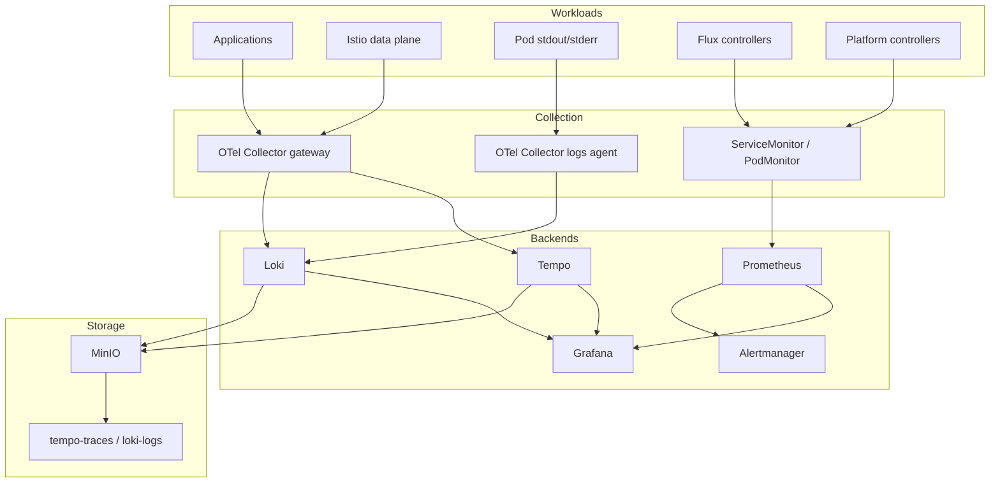
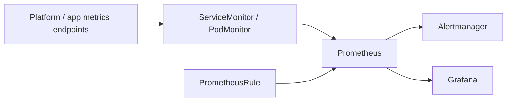
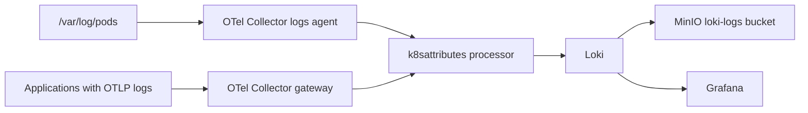
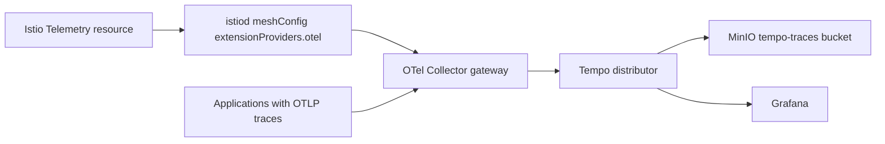
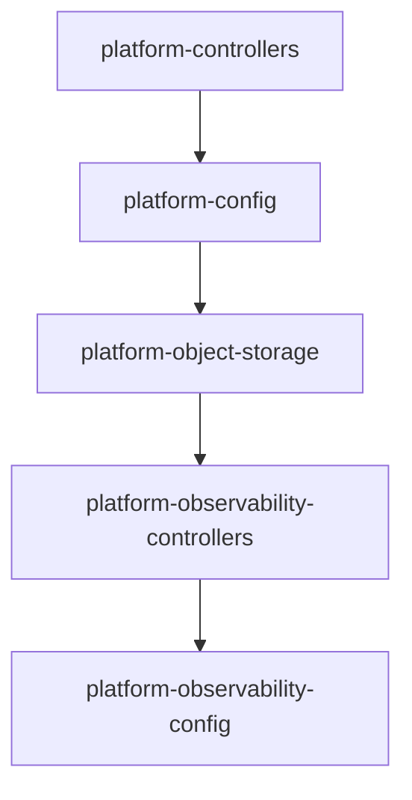
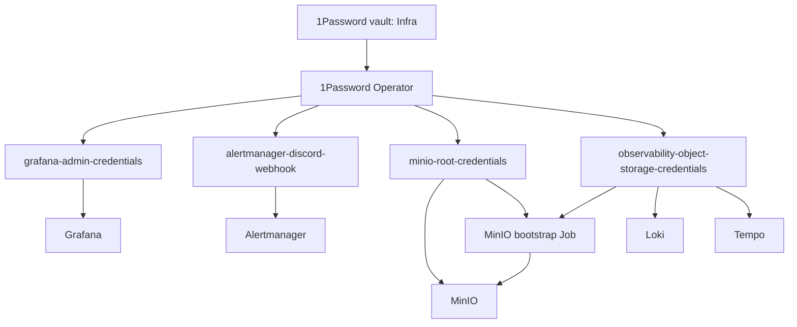

# 監視アーキテクチャ

このドキュメントを監視・可観測性基盤の正規ドキュメントとする。
`kubernetes/platform/controllers/observability/` と `kubernetes/platform/config/observability/` の README は配置物の案内だけを持ち、設計判断や依存関係はここに集約する。

## 設計方針

監視基盤は telemetry の種類ごとに責務を分ける。
metrics は Prometheus ecosystem の ServiceMonitor / PodMonitor を直接使い、OpenTelemetry Collector へ集約しない。
logs と traces は OpenTelemetry Collector を入口にし、backend 固有の protocol や保存先をアプリケーションから隠す。

Grafana は閲覧面、Prometheus は metrics と alert evaluation、Alertmanager は通知、Loki は logs、Tempo は traces を担当する。
Loki / Tempo の object storage は現時点ではクラスタ内部 MinIO を使う。
secret は 1Password Operator で Kubernetes Secret として materialize し、Git には値を置かない。

## 全体構成

## Telemetry 別の経路

### metrics

metrics は Prometheus が scrape する。
この経路は Kubernetes の scrape target と PrometheusRule に閉じており、Collector が落ちても metrics と alerting は継続する。

### logs

logs は 2 経路ある。
Pod の stdout/stderr は node 上の `/var/log/pods` を logs agent が読む。
アプリケーションが OTLP logs を直接送る場合は gateway を通る。
どちらも Loki の OTLP endpoint に集約する。

### traces

traces は Istio とアプリケーションから OTLP で gateway に入り、Tempo へ送る。
Istio は Telemetry resource だけでは送信先を決定できないため、`istiod` の `meshConfig.extensionProviders` にある `otel` provider が必須の依存である。

## GitOps と依存関係

監視基盤は CRD、Secret、storage、backend、設定の順に適用する必要がある。
Flux Kustomization の依存はこの順序を表す。

`platform-controllers` は 1Password Operator、Istio、cert-manager などの controller を提供する。
`platform-config` は OnePasswordItem を適用し、監視基盤が参照する Secret を生成させる。
`platform-object-storage` は MinIO と bucket / user bootstrap を用意する。
`platform-observability-controllers` は Prometheus、Grafana、Alertmanager、Loki、Tempo、OpenTelemetry Operator を導入する。
`platform-observability-config` は Collector CR、Grafana datasource、ServiceMonitor、PrometheusRule、Istio Telemetry を適用する。

## Secret と object storage

MinIO bootstrap Job は `tempo-traces` と `loki-logs` bucket を作り、Loki / Tempo 用の限定 user に policy を付与する。
MinIO は現時点では `emptyDir` であり、observability backend の動作確認と短期保持を目的にする。
長期保持や障害復旧を重視する段階で、StatefulSet / PVC または外部 object storage へ置き換える。

## モジュール境界

| モジュール | 責務 | 呼び出し元 / 依存元 | 提供するもの |
|---|---|---|---|
| `platform/controllers/observability` | 監視 backend と operator の導入 | Flux `platform-observability-controllers` | Prometheus / Grafana / Alertmanager / Loki / Tempo / OpenTelemetry Operator |
| `platform/config/observability` | backend 上に乗る監視設定 | Flux `platform-observability-config` | Collector CR / datasource / scrape target / alert rule / Istio Telemetry |
| `platform/controllers/object-storage` | Loki / Tempo 用 S3 互換 storage | Flux `platform-object-storage` | MinIO service / bucket / limited user |
| `platform/config/onepassword-items` | Secret materialization の宣言 | Flux `platform-config` | 監視基盤が参照する Kubernetes Secret |
| `platform/controllers/istio` | Istio tracing provider の定義 | `istio-telemetry.yaml` | `otel` extension provider |

## 障害時の影響範囲

| 障害箇所 | 影響 | 継続するもの |
|---|---|---|
| OTel Collector gateway | OTLP logs/traces と Istio traces が欠落する | Prometheus metrics / Alertmanager |
| OTel logs agent | Pod stdout/stderr logs が欠落する | OTLP logs / traces / metrics |
| Loki | logs の保存・検索ができない | metrics / traces |
| Tempo | traces の保存・検索ができない | metrics / logs |
| Prometheus | metrics と alert evaluation が止まる | logs / traces の backend 保存 |
| MinIO | Loki / Tempo の object storage 書き込みが失敗する | Prometheus metrics |
| 1Password Operator | 新規・更新 Secret の反映が止まる | 既存 Secret を使う稼働中 workload |

## 運用上の未解決事項

- Grafana の外部公開と Cloudflare Access は未導入。
- MinIO は非永続であり、長期保持や backup は未設計。
- アプリケーションの auto-instrumentation は opt-in として別途設計する。
